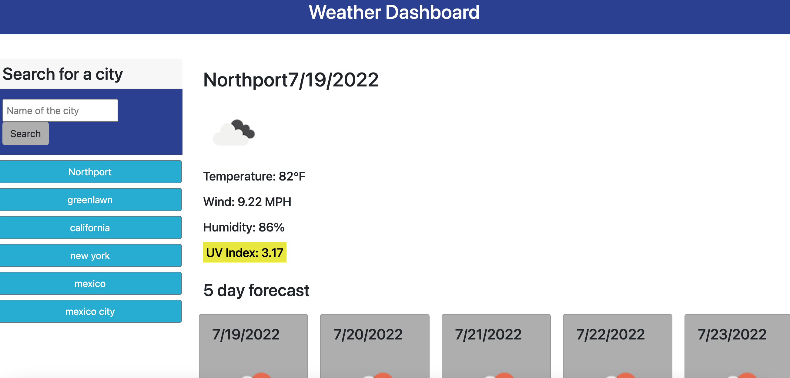

# Weather Dashboard
Built a weather dashboard with the use of server-side APIs   

## Purpose 
This website allows a traveler to look at the weather outlook for multiple cities so they can plan a trip accordingly. 
## Description
The traveler will search for a city and then is presented with current and future conditions for that city and that city is added to the search history. When they view current weather conditions for that city they are presented with the city name, the date, an icon representation of weather conditions, the temperature, the humidity, the wind speed, and the UV index. When the traveler views the UV index
it shows a color that indicates whether the conditions are favorable, moderate, or severe. The traveler is able to view future weather conditions for that city which displays as a 5-day forecast that shows the date, an icon representation of weather conditions, the temperature, the wind speed, and the humidity. There is a search history found on the left hand side of the page where the traveler can press again to see the current and future conditions for that city. 

## Built with 
    *HTML 
    *CSS 
    *JavaScript
    *Bootstrap
    *jQuery
    *OpenWeather API

## Website
https://mtheofield.github.io/weather-dashboard/
 

## GitHub repository
https://github.com/mtheofield/weather-dashboard

Contribution
Made with Mary Theofield 
